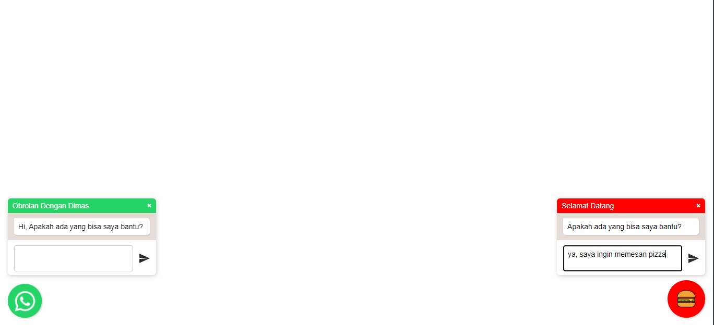
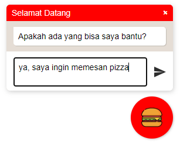
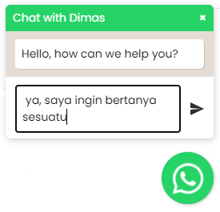

# Floating WhatsApp

Plugin floating WhatsApp dengan menggunakan jQuery.


## Install

Tambahkan File dibawah ini kedalam file html

```html
<!--css-->
<link rel="stylesheet" href="floating-wpp.min.css">

<!--js-->
<script type="text/javascript" src="jquery-3.3.1.min.js"></script>
<script type="text/javascript" src="floating-wpp.min.js"></script>
```

## Cara Menggunakan

Buat elemen div dan implementasikan dengan jquery, maka plugin akan aktif dengan menggunakan fungsi `$().floatingWhatsApp([options])`

```html
<body>
  <!--whatsapp-->
  <div id="whatsapp"></div>
</body>

<!--js-->
<script type="text/javascript">
    $(function () {
        $('#whatsapp').floatingWhatsApp({
            position: 'right',
            size: '65px',
            boxShadow:"10px 20px 80px blue",
            phone: '6285811379583',
            popupMessage: 'Hi, Apakah ada yang bisa saya bantu?',
            message: " ",
            showPopup: true,
            showOnIE: true,
            headerTitle: 'Obrolan Dengan Dimas',
            headerColor: '#25D366',
            backgroundColor: '#25D366',
            buttonImage: ''
        });
    });
</script>
```
### Contoh Floating Whatsapp Makanan

```js
<script type="text/javascript">
    $(function () {
    $('#myButton').floatingWhatsApp({
        phone: '6285811379583',
        popupMessage: 'Apakah ada yang bisa saya bantu?',
        message: "ya, saya ingin memesan pizza",
        showPopup: true,
        showOnIE: false,
        headerTitle: 'Selamat Datang',
        headerColor: 'red',
        backgroundColor: 'red',
        buttonImage: ''
    });
});
</script>;
```



### Contoh Floating Whatsapp Personal

```js
<script type="text/javascript">
    $(function () {
    $('#whatsapp').floatingWhatsApp({
        position: 'right',
        size: '65px',
        boxShadow:"10px 20px 80px blue",
        phone: '6285811379583',
        popupMessage: 'Hi, Apakah ada yang bisa saya bantu?',
        message: " ",
        showPopup: true,
        showOnIE: true,
        headerTitle: 'Obrolan Dengan Dimas',
        headerColor: '#25D366',
        backgroundColor: '#25D366',
        buttonImage: ''
    });
});
</script>
```

