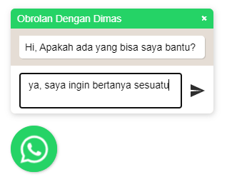

#  Floating WhatsApp

Plugin floating WhatsApp dengan menggunakan jQuery.

## Demo Aplikasi
[Floating Whatsapp Plugin Demo](https://dimas263.github.io/assets/whatsapp)

## Install

Tambahkan File dibawah ini kedalam file html

```html
<!--css-->
<link rel="stylesheet" href="floating-wpp.min.css">

<!--js-->
<script type="text/javascript" src="jquery-3.3.1.min.js"></script>
<script type="text/javascript" src="floating-wpp.min.js"></script>
```

## Cara Menggunakan

Buat elemen div dan implementasikan dengan jquery, maka plugin akan aktif dengan menggunakan fungsi `$().floatingWhatsApp([options])`

```html
<body>
  <!--whatsapp-->
  <div id="whatsapp"></div>
</body>

<!--js-->
<script type="text/javascript">
    $(function () {
        $('#whatsapp').floatingWhatsApp({
            position: 'right',
            size: '65px',
            boxShadow:"10px 20px 80px blue",
            phone: '6285811379583',
            popupMessage: 'Hi, Apakah ada yang bisa saya bantu?',
            message: " ",
            showPopup: true,
            showOnIE: true,
            headerTitle: 'Obrolan Dengan Dimas',
            headerColor: '#25D366',
            backgroundColor: '#25D366',
            buttonImage: ''
        });
    });
</script>
```
### Contoh Floating Whatsapp Makanan

```js
<script type="text/javascript">
    $(function () {
    $('#myButton').floatingWhatsApp({
        phone: '6285811379583',
        popupMessage: 'Apakah ada yang bisa saya bantu?',
        message: "ya, saya ingin memesan pizza",
        showPopup: true,
        showOnIE: false,
        headerTitle: 'Selamat Datang',
        headerColor: 'red',
        backgroundColor: 'red',
        buttonImage: ''
    });
});
</script>;
```


### Contoh Floating Whatsapp Personal

```js
<script type="text/javascript">
    $(function () {
    $('#whatsapp').floatingWhatsApp({
        position: 'right',
        size: '65px',
        boxShadow:"10px 20px 80px blue",
        phone: '6285811379583',
        popupMessage: 'Hi, Apakah ada yang bisa saya bantu?',
        message: " ",
        showPopup: true,
        showOnIE: true,
        headerTitle: 'Obrolan Dengan Dimas',
        headerColor: '#25D366',
        backgroundColor: '#25D366',
        buttonImage: ''
    });
});
</script>
```



## LICENSE
Copyright (c) 2021 Dimas Dwi Putra

Permission is hereby granted, free of charge, to any person obtaining a copy
of this software and associated documentation files (the "Software"), to deal
in the Software without restriction, including without limitation the rights
to use, copy, modify, merge, publish, distribute, sublicense, and/or sell
copies of the Software, and to permit persons to whom the Software is
furnished to do so, subject to the following conditions:

The above copyright notice and this permission notice shall be included in all
copies or substantial portions of the Software.

THE SOFTWARE IS PROVIDED "AS IS", WITHOUT WARRANTY OF ANY KIND, EXPRESS OR
IMPLIED, INCLUDING BUT NOT LIMITED TO THE WARRANTIES OF MERCHANTABILITY,
FITNESS FOR A PARTICULAR PURPOSE AND NONINFRINGEMENT. IN NO EVENT SHALL THE
AUTHORS OR COPYRIGHT HOLDERS BE LIABLE FOR ANY CLAIM, DAMAGES OR OTHER
LIABILITY, WHETHER IN AN ACTION OF CONTRACT, TORT OR OTHERWISE, ARISING FROM,
OUT OF OR IN CONNECTION WITH THE SOFTWARE OR THE USE OR OTHER DEALINGS IN THE
SOFTWARE.

